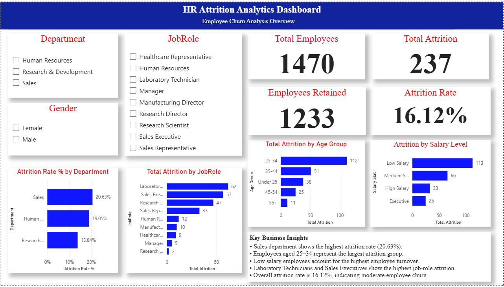

# 📊 HR Attrition Analytics Dashboard (Power BI)

---

## 📌 Project Overview

The **HR Attrition Analytics Dashboard** is an interactive **Power BI data analytics project** designed to analyze employee turnover and identify key factors influencing attrition within an organization.

This dashboard enables HR teams to monitor workforce trends, detect high-risk employee groups, and make **data-driven decisions to improve employee retention strategies**.

---

## 🎯 Project Objectives

The main objectives of this project are:

- Analyze employee attrition trends within the organization
- Identify departments and job roles with high turnover
- Understand demographic patterns related to attrition
- Evaluate the impact of salary levels on employee retention
- Provide actionable insights to support HR decision-making

---

## 📊 Key Metrics

| Metric | Value |
|------|------|
| **Total Employees** | 1470 |
| **Total Attrition** | 237 |
| **Employees Retained** | 1233 |
| **Attrition Rate** | 16.12% |

These KPIs provide a quick overview of the organization’s workforce stability and attrition level.

---

## 📈 Dashboard Features

### 🔎 Interactive Filters
Users can dynamically filter the dashboard using:

- Department
- Gender
- Job Role

This allows deeper exploration of attrition patterns.

---

### 📊 Attrition Analysis

The dashboard provides multiple analytical views:

- **Attrition Rate by Department**
- **Total Attrition by Job Role**
- **Attrition by Age Group**
- **Attrition by Salary Level**

These visualizations help identify high-risk areas in the organization.

---

## 📊 Key Business Insights

- **Sales department has the highest attrition rate (20.63%)**, indicating potential workload or management challenges.
- **Employees aged 25–34 represent the largest attrition group**, suggesting higher turnover among early-career professionals.
- **Low salary employees contribute the highest attrition numbers**, highlighting compensation as a possible retention factor.
- **Laboratory Technicians and Sales Executives show the highest job-role attrition**, indicating role-specific retention challenges.
- The **overall attrition rate of 16.12%** suggests moderate employee churn within the organization.

---

## 🛠 Tools & Technologies Used

- **Power BI Desktop**
- **Data Visualization**
- **DAX Measures**
- **Data Analysis**
- **Interactive Dashboard Design**

---

## 💡 Business Value

This dashboard helps organizations:

- Identify departments with high employee turnover
- Understand demographic attrition patterns
- Analyze salary-based attrition trends

---

## 📁 Project Structure
Power-Bi
│
├── dashboard
│   └── image.png
│
├── dataset
│   ├── hr_attrition_cleaned_data.csv
│   └── hr_employee_attrition.csv
│
├── HR Analytics & Attrition Dashboard.pbix
│
└── README.md

---

## 📷 Dashboard Preview

---

## ▶ How to View the Dashboard

To explore this dashboard:

1. Download the **Power BI file (.pbix)** from this repository.
2. Open the file using **Microsoft Power BI Desktop**.
3. Use the interactive filters (Department, Gender, Job Role) to explore employee attrition insights.

If you don't have Power BI Desktop installed, you can download it here:

https://powerbi.microsoft.com/desktop/

---

## 📍 Data Source

IBM HR Analytics & Attrition dataset from Kaggle
(Used to derive insights and build the dashboard.)

---

## 📊 Project Outcome

This dashboard identifies key drivers of employee attrition, highlighting high-risk departments, job roles, and salary segments.  
It enables HR teams to quickly detect turnover patterns and take proactive, data-driven actions to improve employee retention and workforce stability.

---

🔗 GitHub  
https://github.com/meghanath0225/Power-Bi

---
